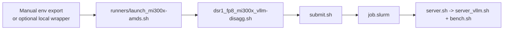

# AMDSOW InferenceX Benchmark Onboarding

This guide is for engineers who are new to InferenceX, Slurm, GitHub self-hosted runners, and the AMDSOW MI300X benchmark flow. It explains the current AMDSOW DeepSeek-R1-0528 FP8 MI300X vLLM PD-disaggregation setup from the config YAML down to the Slurm job, Docker container, vLLM servers, and benchmark client.

The source of truth for the current AMDSOW MI300X benchmark is:

```text
.github/configs/amd-master.yaml
  key: dsr1-fp8-mi300x-vllm-disagg
```

Optional local wrappers such as `run_dsr1_mi300x_validation.sh` are not the source of truth. That wrapper exists in this checkout as a gitignored/local convenience file, but another clone may not have it. It only pre-fills the environment variables that GitHub Actions normally exports.

---

## 1. One-sentence mental model

InferenceX starts with a YAML benchmark definition, expands it into a GitHub Actions matrix, runs that matrix on a self-hosted GitHub runner, calls a cluster-specific launcher, submits a Slurm job, starts Docker containers on GPU compute nodes, runs prefill/decode vLLM servers, and finally sends benchmark traffic through the router.

```mermaid
flowchart LR
  A[amd-master.yaml<br/>What to run] --> B[generate_sweep_configs.py<br/>YAML to matrix JSON]
  B --> C[e2e-tests.yml<br/>Split single/multi/eval jobs]
  C --> D[benchmark-multinode-tmpl.yml<br/>Matrix values to env vars]
  D --> E[GitHub self-hosted runner<br/>example: mi300x-amds_06]
  E --> F[runners/launch_mi300x-amds.sh<br/>Cluster defaults]
  F --> G[dsr1_fp8_mi300x_vllm-disagg.sh<br/>InferenceX recipe driver]
  G --> H[submit.sh<br/>Build sbatch command]
  H --> I[job.slurm<br/>Docker on Slurm compute nodes]
  I --> J[server.sh -> server_vllm.sh<br/>Prefill/decode vLLM servers]
  J --> K[bench.sh<br/>OpenAI-compatible benchmark client]
```



Manual cluster runs replace the GitHub Actions part with manually exported environment variables:



---

## 2. Three concepts beginners must not mix up

These names sound similar but live at different layers.

| Concept | Where it appears | Meaning | Example |
|---|---|---|---|
| GitHub self-hosted runner | `.github/configs/runners.yaml`, workflow `runs-on`, workflow `runner.name` | The process/name/label that receives a GitHub Actions job. Normal `full-sweep`/`test-config` jobs pass a runner label/type to `runs-on`; GitHub chooses one actual runner with that label. | label/type: `mi300x-disagg`; actual runner name: `mi300x-amds_06` |
| Slurm login/compute node | `squeue`, `sinfo`, `sbatch`, optional `NODELIST` | Real cluster nodes allocated by Slurm for GPU work. `NODELIST` asks Slurm for specific compute nodes. | `a04u01,a04u19,a04u25,a04u37` |
| Benchmark worker | `prefill.num-worker`, `decode.num-worker`, `xP`, `yD` | vLLM server-role worker count: prefill workers and decode workers. In the current MI300X matrix, worker count equals node count per role, but this is still a separate knob from `*_NODES`. | `1P3D`: 1 prefill worker, 3 decode workers |

Relationship:

```text
GitHub runner name: mi300x-amds_06
  -> selects launcher: runners/launch_mi300x-amds.sh

Slurm nodes:
  -> submit.sh computes NUM_NODES=$((PREFILL_NODES + DECODE_NODES))
  -> sbatch requests -N "$NUM_NODES"
  -> optional NODELIST count must equal NUM_NODES

Benchmark workers:
  -> xP=$PREFILL_NUM_WORKERS, yD=$DECODE_NUM_WORKERS
  -> server_vllm.sh assigns node roles by NODE_RANK
```

Important: `mi300x-amds_06` is a GitHub runner name. `a04u01` is a Slurm compute node name. They are different namespaces.

---

## 3. File map

| File | Role |
|---|---|
| `.github/configs/amd-master.yaml` | AMD benchmark source of truth. Defines image, model, runner label, framework, sequence lengths, concurrency, topology, and extra env settings. |
| `.github/configs/runners.yaml` | Records which actual self-hosted runner names can satisfy a runner label/type. Normal `test-config` jobs pass the label; GitHub selects the actual runner. |
| `utils/matrix_logic/generate_sweep_configs.py` | Converts master YAML entries into GitHub Actions matrix JSON. Supports `full-sweep`, `runner-model-sweep`, and `test-config`. |
| `.github/workflows/e2e-tests.yml` | Main workflow entrypoint. Runs the generator and splits JSON into single-node, multi-node, eval, and agentic matrices. |
| `.github/workflows/benchmark-multinode-tmpl.yml` | Reusable multi-node workflow. Converts matrix fields into environment variables and calls the cluster launcher. |
| `runners/launch_mi300x-amds.sh` | AMDSOW MI300X cluster launcher. Sets Slurm account/partition, model path, NIC defaults, GPU count, log path, and invokes the derived benchmark recipe script. |
| `benchmarks/multi_node/dsr1_fp8_mi300x_vllm-disagg.sh` | DSR1 MI300X vLLM-disagg recipe driver. Validates env, converts YAML topology fields into submit args, and calls `submit.sh`. |
| `benchmarks/multi_node/amd_utils/submit.sh` | Slurm submitter. Computes node count, worker count, TP sizes, env propagation, optional `NODELIST`, and the final `sbatch` command. |
| `benchmarks/multi_node/amd_utils/job.slurm` | Slurm job body. Resolves model path, selects nodes/IPs, starts the external vLLM router, and launches Docker on compute nodes. |
| `benchmarks/multi_node/amd_utils/server.sh` | Docker-side dispatcher. Selects `server_vllm.sh`, `server_sglang.sh`, or `server_atom.sh` from `ENGINE`. |
| `benchmarks/multi_node/amd_utils/server_vllm.sh` | vLLM PD server implementation. Assigns prefill/decode roles by rank, builds MoRIIO KV configs, applies TP/DP8EP/MTP flags, and runs benchmark traffic from rank 0. |
| `benchmarks/multi_node/amd_utils/models_vllm.yaml` | Model-specific vLLM flags/env. The `DeepSeek-R1-0528` entry contains the TP8 and DP8EP profiles. |
| `benchmarks/multi_node/amd_utils/bench.sh` | Benchmark client. Sends OpenAI-compatible requests to the router and writes JSON result files. |
| `run_dsr1_mi300x_validation.sh` | Optional local/gitignored convenience wrapper in this checkout. It is only an env preset for manual validation, not source of truth. |

---

## 4. The current best AMDSOW config

When we say “our best/current AMDSOW config” in this branch, we mean this checked-in InferenceX config:

```yaml
dsr1-fp8-mi300x-vllm-disagg:
  image: docker.io/chaeminlimmb/vllm-mori-pd:milestone4-aiterwheel
  model: deepseek-ai/DeepSeek-R1-0528
  model-prefix: dsr1
  runner: mi300x-disagg
  precision: fp8
  framework: vllm-disagg
  multinode: true
  disagg: true
```

Meaning:

| Field | Meaning | Downstream effect |
|---|---|---|
| `image` | Server container image | Becomes workflow env `IMAGE`, then launcher env `CONTAINER_IMAGE`, then Docker image. |
| `model` | Model id | Becomes workflow env `MODEL`; launcher derives `MODEL_NAME=${MODEL##*/}` → `DeepSeek-R1-0528`. |
| `model-prefix` | InferenceX model prefix | Used in script/result naming. `dsr1` leads to `dsr1_fp8_mi300x_vllm-disagg.sh`. |
| `runner` | GitHub `runs-on` label/type | Normal `full-sweep`/`test-config` matrix keeps this as `mi300x-disagg`; GitHub chooses an actual runner with that label. |
| `precision` | Precision label | Used in script/result naming and metadata. |
| `framework` | Serving runtime | `vllm-disagg` selects the multi-node vLLM disaggregation path. |
| `multinode` | Multi-node flag | `e2e-tests.yml` routes entries with `prefill` to the multi-node workflow. |
| `disagg` | Prefill/decode disaggregation flag | Metadata and workflow naming. |

The current matrix is:

| ISL/OSL | Concurrency | Topology | Slurm nodes | MTP | Notes |
|---|---:|---|---:|---:|---|
| 1k1k | 6, 9, 30, 60, 117 | TP8 1P1D | 2 | 3 | Low/mid concurrency TP8 path. |
| 1k1k | 231 | TP8 1P1D | 2 | 1 | TP8 with smaller MTP depth. |
| 1k1k | 462, 615, 1229 | DP8EP 1P1D | 2 | 1 | Wide-EP/DP8EP profile for high concurrency. |
| 8k1k | 6, 9, 16, 24 | TP8 1P3D | 4 | 3 | Prefill-heavy, more decode nodes. |
| 8k1k | 30 | TP8 1P2D | 3 | 3 | Current checked-in row is 1 prefill + 2 decode nodes. |
| 8k1k | 77 | TP8 2P1D | 3 | 2 | More prefill, one decode. |
| 8k1k | 154 | TP8 2P2D | 4 | 3 | Balanced 2 prefill / 2 decode. |
| 8k1k | 256 | TP8-prefill / DP8EP-decode 2P1D | 3 | 0 | Mixed profile, no MTP. |
| 8k1k | 512 | TP8-prefill / DP8EP-decode 2P1D | 3 | 3 | Mixed profile with MTP3. |

How one row is encoded, example `8k1k`, conc `6/9/16/24`, TP8 `1P3D`, MTP3:

```yaml
- isl: 8192
  osl: 1024
  search-space:
  - spec-decoding: "mtp"
    conc-list: [ 6, 9, 16, 24 ]
    prefill:
      num-worker: 1
      tp: 8
      ep: 1
      dp-attn: false
      additional-settings:
      - "PREFILL_NODES=1"
    decode:
      num-worker: 3
      tp: 8
      ep: 1
      dp-attn: false
      additional-settings:
      - "DECODE_NODES=3"
      - "DECODE_MTP_SIZE=3"
```

Read it as:

```text
ISL/OSL            = 8192 input tokens / 1024 output tokens
conc-list          = benchmark concurrency points
prefill.num-worker = xP = prefill worker count
prefill.tp         = tensor parallel size per prefill node
prefill.ep         = 1 means no expert-parallel flag for TP8 path
PREFILL_NODES      = Slurm prefill node count
decode.num-worker  = yD = decode worker count
DECODE_NODES       = Slurm decode node count
DECODE_MTP_SIZE    = vLLM deepseek_mtp speculative token count
```

---

## 5. GitHub Actions automatic execution path

### 5.1 Matrix generation

`e2e-tests.yml` receives `inputs[generate-cli-command]` and runs:

```bash
python3 ${GITHUB_WORKSPACE}/utils/matrix_logic/generate_sweep_configs.py \
  ${{ inputs.generate-cli-command }}
```

The generated JSON is split into buckets:

```text
single-node throughput
multi-node throughput
single-node eval
multi-node eval
single-node agentic
multi-node agentic
```

For this config, throughput entries are multi-node entries because they contain `prefill`/`decode` and `multinode: true`.

### 5.2 Multi-node template env mapping

`benchmark-multinode-tmpl.yml` maps matrix fields into env vars:

```yaml
EXP_NAME: ${{ inputs.exp-name }}
IMAGE: ${{ inputs.image }}
MODEL: ${{ inputs.model }}
MODEL_PREFIX: ${{ inputs.model-prefix }}
FRAMEWORK: ${{ inputs.framework }}
PRECISION: ${{ inputs.precision }}
ISL: ${{ inputs.isl }}
OSL: ${{ inputs.osl }}
CONC_LIST: ${{ join(fromJson(inputs.conc-list), ' ') }}
SPEC_DECODING: ${{ inputs.spec-decoding }}
PREFILL_NUM_WORKERS: ${{ inputs.prefill-num-worker }}
PREFILL_TP: ${{ inputs.prefill-tp }}
PREFILL_EP: ${{ inputs.prefill-ep }}
PREFILL_DP_ATTN: ${{ inputs.prefill-dp-attn }}
DECODE_NUM_WORKERS: ${{ inputs.decode-num-worker }}
DECODE_TP: ${{ inputs.decode-tp }}
DECODE_EP: ${{ inputs.decode-ep }}
DECODE_DP_ATTN: ${{ inputs.decode-dp-attn }}
```

Then it exports additional settings from YAML:

```bash
export ${{ join(fromJson(inputs.prefill-additional-settings), ' ') }} \
       ${{ join(fromJson(inputs.decode-additional-settings), ' ') }}
export IS_MULTINODE=true
bash ./runners/launch_${RUNNER_NAME%%_*}.sh
```

Example: if the actual GitHub runner is `mi300x-amds_06`, then `${RUNNER_NAME%%_*}` is `mi300x-amds`, so the launcher is:

```text
runners/launch_mi300x-amds.sh
```

---

## 6. GitHub runner bridge

The config uses:

```yaml
runner: mi300x-disagg
```

The runner inventory contains:

```yaml
mi300x-disagg:
- 'mi300x-amds_06'
- 'mi300x-amds_07'
- 'mi300x-amds_08'
```

Normal `full-sweep` and `test-config` runs do not generally expand the matrix runner to one concrete runner name. The matrix keeps `runner: mi300x-disagg`; GitHub Actions uses `runs-on: mi300x-disagg` and chooses an available self-hosted runner with that label. Inside the job, `runner.name` becomes the concrete runner name, for example `mi300x-amds_06`.

`runner-model-sweep` or `--runner-node-filter` can intentionally expand/select specific runner names.

---

## 7. Slurm basics for this project

Slurm is the cluster scheduler. It allocates real GPU compute nodes and starts commands on them.

Useful commands on the cluster login node:

```bash
squeue -u amd                         # current jobs for user amd
sinfo -p compute -N -o '%N %t'         # node states in compute partition
sinfo -p compute -N -o '%N %t' | grep idle
sbatch ...                            # submit a batch job
scancel <jobid>                       # cancel a job
```

InferenceX multi-node Slurm submission happens in `submit.sh`:

```text
submit.sh
  -> sbatch --export=ALL --exclusive -N "$NUM_NODES" -n "$NUM_NODES" ... job.slurm
```

`--export=ALL` carries the exported environment into Slurm `job.slurm`. The Docker container does not automatically receive every variable; only variables explicitly passed by `job.slurm` with `-e` enter the container. If a new `additional-settings` variable must be used inside Docker, check/update the Docker env list in `job.slurm`.

### Optional NODELIST

Manual cluster runs can select specific idle nodes:

```bash
export NODELIST="a04u01,a04u19,a04u25,a04u37"
```

`submit.sh` validates that the count equals:

```text
NUM_NODES = PREFILL_NODES + DECODE_NODES
```

If `NODELIST` is omitted, Slurm chooses nodes subject to partition availability and exclude settings.

---

## 8. The MI300X launcher

`runners/launch_mi300x-amds.sh` turns workflow/manual env vars into a cluster-specific run.

Multi-node branch responsibilities:

```bash
export SLURM_ACCOUNT="$USER"
export SLURM_PARTITION="compute"
export SLURM_JOB_NAME="benchmark-disagg.job"
export MODEL_NAME=${MODEL##*/}
export MODEL_PATH="${AMDSOW_MODEL_DIR:-/models/models}"
export MODEL_DIR="$MODEL_PATH"
export IBDEVICES="rocep28s0,..."
export MORI_RDMA_DEVICES="$IBDEVICES"
export MORI_RDMA_TC=104
export GPUS_PER_NODE=8
SCRIPT_NAME="${EXP_NAME%%_*}_${PRECISION}_mi300x_${FRAMEWORK}.sh"
JOB_ID=$(bash "benchmarks/${BENCHMARK_SUBDIR}/${SCRIPT_NAME}")
```

For this config:

```text
EXP_NAME=dsr1_8k1k
PRECISION=fp8
FRAMEWORK=vllm-disagg
SCRIPT_NAME=dsr1_fp8_mi300x_vllm-disagg.sh
```

The launcher does not decide the benchmark topology. The row is already encoded in YAML/env. The launcher only injects cluster defaults and calls the correct recipe script.

---

## 9. Recipe driver: `dsr1_fp8_mi300x_vllm-disagg.sh`

This script is intentionally topology-agnostic. It expects every row-specific value to arrive through env vars from GitHub Actions or manual export.

It requires values such as:

```text
CONC_LIST, ISL, OSL, IMAGE, SPEC_DECODING, MODEL_PATH,
PREFILL_NUM_WORKERS, PREFILL_TP, PREFILL_EP, PREFILL_DP_ATTN, PREFILL_NODES,
DECODE_NUM_WORKERS, DECODE_TP, DECODE_EP, DECODE_DP_ATTN, DECODE_NODES,
RANDOM_RANGE_RATIO, FRAMEWORK
```

Main steps:

1. Set `MODEL_NAME`, `CONTAINER_IMAGE`, and time limit.
2. Convert `PREFILL_EP`/`DECODE_EP` into role booleans such as `PREFILL_ENABLE_EP`.
3. Forward `DECODE_MTP_SIZE`, `PREFILL_DP8EP`, and `DECODE_DP8EP`.
4. If DP8EP is enabled, disable the legacy EP/DP-attention booleans to avoid duplicate flags.
5. Call `submit.sh`.

Call shape:

```bash
bash ./submit.sh \
  $PREFILL_NODES $PREFILL_NUM_WORKERS \
  $DECODE_NODES $DECODE_NUM_WORKERS \
  $ISL $OSL "${CONC_LIST// /x}" inf \
  $PREFILL_ENABLE_EP $PREFILL_ENABLE_DP \
  $DECODE_ENABLE_EP $DECODE_ENABLE_DP \
  $PREFILL_TP $DECODE_TP \
  $RANDOM_RANGE_RATIO \
  "${NODELIST:-}"
```

`CONC_LIST="6 9"` becomes `6x9` for `submit.sh`; `bench.sh` later splits on `x`.

---

## 10. `submit.sh`: turning config into Slurm

`submit.sh` computes:

```bash
NUM_NODES=$((PREFILL_NODES + DECODE_NODES))
xP=$PREFILL_WORKERS
yD=$DECODE_WORKERS
PREFILL_TP_SIZE=$((PREFILL_NODES * PREFILL_TP / PREFILL_WORKERS))
DECODE_TP_SIZE=$((DECODE_NODES * DECODE_TP / DECODE_WORKERS))
```

Then it exports values for `job.slurm`:

```bash
ENGINE=$FRAMEWORK
MODEL_DIR=$MODEL_PATH
DOCKER_IMAGE_NAME=$CONTAINER_IMAGE
BENCH_INPUT_LEN=$ISL
BENCH_OUTPUT_LEN=$OSL
BENCH_MAX_CONCURRENCY=$CONCURRENCIES
DECODE_MTP_SIZE=${DECODE_MTP_SIZE:-0}
PREFILL_DP8EP=${PREFILL_DP8EP:-false}
DECODE_DP8EP=${DECODE_DP8EP:-false}
```

Then it submits:

```bash
sbatch \
  --parsable \
  --export=ALL \
  --exclusive \
  -N "$NUM_NODES" \
  -n "$NUM_NODES" \
  --time "$TIME_LIMIT" \
  --partition "$SLURM_PARTITION" \
  --account "$SLURM_ACCOUNT" \
  --job-name "$RUNNER_NAME" \
  --output "${BENCHMARK_LOGS_DIR}/slurm_job-%j.out" \
  --error "${BENCHMARK_LOGS_DIR}/slurm_job-%j.err" \
  job.slurm
```

Important caveat: `submit.sh` allocates `PREFILL_NODES + DECODE_NODES`, but `job.slurm` later selects the nodes used by the server roles from `xP + yD` (`PREFILL_NUM_WORKERS + DECODE_NUM_WORKERS`). Current AMDSOW MI300X rows keep `*_NODES == *_NUM_WORKERS` per role, so the counts match. If someone later tries to make one worker span multiple nodes, validate or update `job.slurm` node selection and role assignment instead of assuming that it is generally supported.

---

## 11. `job.slurm`: Docker boundary and node selection

`job.slurm` is the Slurm job body.

Main responsibilities:

- Select `models_vllm.yaml` for `ENGINE=vllm-disagg`.
- Validate that `DOCKER_IMAGE_NAME` and `MODEL_NAME` are set.
- Resolve model path from host storage into the Docker `/models` namespace.
- Read `xP` and `yD`, then use `xP + yD` for server role assignment node selection. Current AMDSOW rows have `*_NODES == *_NUM_WORKERS`, so this matches the Slurm allocation count.
- Start external `vllm-router` on rank 0.
- Run Docker on selected nodes.
- Pass required env vars into Docker with `-e`.

Important Docker env examples:

```text
MODEL_NAME
GPUS_PER_NODE
xP / yD
IPADDRS
BENCH_INPUT_LEN / BENCH_OUTPUT_LEN
BENCH_MAX_CONCURRENCY
ENGINE / FRAMEWORK / PRECISION / MODEL_PREFIX
RESULT_FILENAME / SPEC_DECODING
PREFILL_TP_SIZE / PREFILL_ENABLE_EP / PREFILL_ENABLE_DP / PREFILL_DP8EP
DECODE_TP_SIZE / DECODE_ENABLE_EP / DECODE_ENABLE_DP / DECODE_DP8EP
DECODE_MTP_SIZE
```

---

## 12. `server.sh` and `server_vllm.sh`

`server.sh` is a dispatcher. For this config:

```text
ENGINE=vllm-disagg -> server_vllm.sh
```

`server_vllm.sh` assigns roles by Slurm/Docker `NODE_RANK`:

```text
NODE_RANK == 0          -> proxy/router + first prefill node
0 < NODE_RANK < xP      -> additional prefill nodes
NODE_RANK >= xP         -> decode nodes
```

For 1P3D:

```text
xP=1, yD=3
rank 0 -> prefill + proxy
rank 1 -> decode
rank 2 -> decode
rank 3 -> decode
```

For 2P1D:

```text
xP=2, yD=1
rank 0 -> prefill + proxy
rank 1 -> additional prefill
rank 2 -> decode
```

### Model flags

`server_vllm.sh` reads `benchmarks/multi_node/amd_utils/models_vllm.yaml` and loads the `DeepSeek-R1-0528` entry.

Two profile families exist:

| Profile | Selected by | Meaning |
|---|---|---|
| TP8 | `PREFILL_DP8EP=false`, `DECODE_DP8EP=false` | Normal tensor-parallel profile with TP injected by `PREFILL_TP_SIZE`/`DECODE_TP_SIZE`. |
| DP8EP | `PREFILL_DP8EP=true` and/or `DECODE_DP8EP=true` | Wide-EP profile. `server_vllm.sh` emits `--tensor-parallel-size 1 --data-parallel-size <GPUS_PER_NODE> --enable-expert-parallel --all2all-backend mori`. |

### MTP

If `DECODE_MTP_SIZE > 0`, `server_vllm.sh` appends this to both prefill and decode commands:

```bash
--speculative-config '{"method":"deepseek_mtp","num_speculative_tokens":<DECODE_MTP_SIZE>}'
```

This is intentional: DeepSeek MTP needs matching MTP layers across the PD pair.

---

## 13. `bench.sh`: result generation

`bench.sh` sends OpenAI-compatible benchmark traffic to the router.

Inputs include:

```text
prefill/decode worker counts
prefill/decode GPU counts
model dir/name
ISL/OSL
concurrency list
request rate
random range ratio
```

Result file names include concurrency, total GPUs, prefill GPUs, and decode GPUs:

```text
concurrency_<conc>_req_rate_<rate>_gpus_<total>_ctx_<prefill_gpus>_gen_<decode_gpus>.json
```

For `vllm-disagg` with MTP enabled, the benchmark client also gets `--use-chat-template`.

---

## 14. How to run our best config

There are two supported ways to run the current AMDSOW config: GitHub Actions or direct manual cluster invocation.

### 14.1 Recommended: GitHub Actions `test-config`

First validate that the generator creates the row you want.

Example: run only the checked-in `8k1k`, `conc=512`, mixed TP8-prefill / DP8EP-decode, MTP3 row:

```bash
.venv/bin/python utils/matrix_logic/generate_sweep_configs.py test-config \
  --config-files .github/configs/amd-master.yaml \
  --config-keys dsr1-fp8-mi300x-vllm-disagg \
  --seq-lens 8k1k \
  --conc 512 \
  --no-evals
```

Expected shape:

```text
runner: mi300x-disagg
framework: vllm-disagg
isl/osl: 8192/1024
conc: [512]
prefill: num-worker=2, tp=8, ep=1, PREFILL_NODES=2
decode:  num-worker=1, tp=8, ep=8, DECODE_NODES=1, DECODE_DP8EP=true, DECODE_MTP_SIZE=3
```

Dispatch it:

```bash
gh api -X POST \
  /repos/SemiAnalysisAI/InferenceX/actions/workflows/e2e-tests.yml/dispatches \
  -f ref='main' \
  -f 'inputs[ref]=<branch-or-sha-under-test>' \
  -f 'inputs[test-name]=DSR1 MI300X vLLM disagg 8k1k c512' \
  -f 'inputs[generate-cli-command]=test-config --config-files .github/configs/amd-master.yaml --config-keys dsr1-fp8-mi300x-vllm-disagg --seq-lens 8k1k --conc 512 --no-evals' \
  -f 'inputs[duration-override]='
```

Monitor:

```bash
RUN_ID=$(gh run list --repo SemiAnalysisAI/InferenceX \
  --workflow e2e-tests.yml \
  --event workflow_dispatch \
  --limit 1 \
  --json databaseId \
  --jq '.[0].databaseId')

gh run watch "$RUN_ID" --repo SemiAnalysisAI/InferenceX --exit-status
```

Failure logs:

```bash
gh run view "$RUN_ID" --repo SemiAnalysisAI/InferenceX --log-failed
```

Other examples:

```bash
# All rows in the config, throughput only
test-config --config-files .github/configs/amd-master.yaml \
  --config-keys dsr1-fp8-mi300x-vllm-disagg \
  --no-evals

# Only 1k1k rows
test-config --config-files .github/configs/amd-master.yaml \
  --config-keys dsr1-fp8-mi300x-vllm-disagg \
  --seq-lens 1k1k \
  --no-evals

# Only 8k1k conc 6
test-config --config-files .github/configs/amd-master.yaml \
  --config-keys dsr1-fp8-mi300x-vllm-disagg \
  --seq-lens 8k1k \
  --conc 6 \
  --no-evals
```

Those three are workflow input fragments. For local generator validation, prepend:

```bash
.venv/bin/python utils/matrix_logic/generate_sweep_configs.py
```

### 14.2 Manual cluster run

Use this when you are on the cluster login node and want to reproduce what the GitHub workflow would export.

Check availability first:

```bash
squeue -u amd
sinfo -p compute -N -o '%N %t' | grep idle
```

Example: run the same likely best row as the GitHub example: `8k1k`, mixed TP8-prefill / DP8EP-decode, MTP3, concurrency `512`.

```bash
cd /mnt/shared_mango/amdsow-deliveries/regress/amdsow-inferencex-pr

export EXP_NAME="dsr1_8k1k" ISL=8192 OSL=1024 CONC_LIST="512" SPEC_DECODING="mtp" RESULT_FILENAME="validation_mixed_8k_c512"
export PREFILL_NUM_WORKERS=2 PREFILL_TP=8 PREFILL_EP=1 PREFILL_DP_ATTN=false PREFILL_NODES=2 PREFILL_DP8EP=false
export DECODE_NUM_WORKERS=1 DECODE_TP=8 DECODE_EP=8 DECODE_DP_ATTN=false DECODE_NODES=1 DECODE_DP8EP=true DECODE_MTP_SIZE=3
export NODELIST="a04u01,a04u19,a04u25"  # example only; replace with 3 currently idle nodes, or omit to let Slurm choose
export GITHUB_WORKSPACE="$PWD" BENCHMARK_LOGS_DIR="$PWD/benchmark_logs"
export RUNNER_NAME="mi300x-amds_06" IS_MULTINODE=true KEEP_LOGS=1 PRECISION=fp8 FRAMEWORK="vllm-disagg"
export MODEL="deepseek-ai/DeepSeek-R1-0528" IMAGE="docker.io/chaeminlimmb/vllm-mori-pd:milestone4-aiterwheel" RANDOM_RANGE_RATIO=0.8

setsid bash runners/launch_mi300x-amds.sh </dev/null >/tmp/run_mixed_8k_c512.log 2>&1 &
tail -f /tmp/run_mixed_8k_c512.log
```

For a cheaper smoke test, use the checked-in `8k1k`, TP8 `1P3D`, MTP3, concurrency `6` row instead: `CONC_LIST=6`, `PREFILL_NUM_WORKERS=1`, `PREFILL_NODES=1`, `DECODE_NUM_WORKERS=3`, `DECODE_NODES=3`, `DECODE_DP8EP=false`, `DECODE_MTP_SIZE=3`, and a 4-node `NODELIST`.

If the optional local wrapper exists, it can do the same env setup for predefined cases:

```bash
setsid bash run_dsr1_mi300x_validation.sh tp8_8k \
  </dev/null >/tmp/run_tp8_8k.log 2>&1 &
```

Treat the wrapper as a shortcut only. Before running, derive the real row from `.github/configs/amd-master.yaml` and choose currently idle Slurm nodes.

---

## 15. If you change the config, edit the right file

| Change | File |
|---|---|
| Concurrency, ISL/OSL, prefill/decode worker count, node count, TP/EP, MTP size | `.github/configs/amd-master.yaml` |
| vLLM launch flags, AITER/MoRI/vLLM env, TP8 vs DP8EP profiles | `benchmarks/multi_node/amd_utils/models_vllm.yaml` |
| Cluster model path, NIC list, Slurm account/partition defaults | `runners/launch_mi300x-amds.sh` |
| Slurm submission mechanics, `NODELIST`, `sbatch` flags | `benchmarks/multi_node/amd_utils/submit.sh` |
| Docker env propagation, node/IP selection, router/container orchestration | `benchmarks/multi_node/amd_utils/job.slurm` |
| Engine dispatch inside Docker | `benchmarks/multi_node/amd_utils/server.sh` |
| Prefill/decode vLLM command construction | `benchmarks/multi_node/amd_utils/server_vllm.sh` |
| Benchmark request behavior and result file names | `benchmarks/multi_node/amd_utils/bench.sh` |
| Manual validation shortcut | Optional local `run_dsr1_mi300x_validation.sh`, but keep YAML as source of truth. |

---

## 16. Debugging checklist

### Job does not start

- For GitHub Actions, check that `runner: mi300x-disagg` is passed as the `runs-on` label/type.
- Check that `.github/configs/runners.yaml` contains actual self-hosted runners for that label.
- In the multi-node template, distinguish `runs-on` label/type from actual `runner.name`.
- For manual runs, check that `RUNNER_NAME` prefix matches a launcher: `mi300x-amds_06` -> `runners/launch_mi300x-amds.sh`.

### Slurm allocation fails

- Check current jobs: `squeue -u amd`.
- Check idle nodes: `sinfo -p compute -N -o '%N %t' | grep idle`.
- If using `NODELIST`, ensure its node count equals `PREFILL_NODES + DECODE_NODES`.
- Check `SLURM_EXCLUDE_NODES` if Slurm refuses your chosen nodes.

### vLLM command does not match expectations

- Check `benchmarks/multi_node/amd_utils/models_vllm.yaml`, entry `DeepSeek-R1-0528`.
- If `PREFILL_DP8EP` or `DECODE_DP8EP` is true, `server_vllm.sh` uses DP8EP flags, not the TP8 flags.
- If `DECODE_MTP_SIZE > 0`, speculative config is added to both prefill and decode commands.
- If a new env var is missing inside the container, verify that `job.slurm` passes it with `-e`.

### Result file is missing

- `benchmark-multinode-tmpl.yml` expects `${RESULT_FILENAME}_*.json`.
- `launch_mi300x-amds.sh` copies latest result files from Slurm logs back to the GitHub workspace.
- `bench.sh` result files look like `concurrency_*_gpus_*_ctx_*_gen_*.json`.

---

## 17. Glossary

| Term | Meaning |
|---|---|
| InferenceX / InfX | Benchmark generation/execution/result collection system for LLM inference. |
| Config key | Top-level key in `.github/configs/*-master.yaml`, e.g. `dsr1-fp8-mi300x-vllm-disagg`. |
| ISL / OSL | Input Sequence Length / Output Sequence Length. `1k1k` means `1024/1024`; `8k1k` means `8192/1024`. |
| Concurrency | Number of simultaneous benchmark requests. |
| TP | Tensor Parallelism. Splits model tensors across GPUs. |
| EP | Expert Parallelism. Splits MoE experts across GPUs/ranks. |
| DP-attn | Data-parallel attention. Framework-specific; scripts must translate it into real runtime flags. |
| DP8EP | The wide-EP profile used by this MI300X vLLM config. It is not the same thing as `dp-attn`. |
| MTP | Multi-Token Prediction / speculative decoding. Controlled here by `DECODE_MTP_SIZE`. |
| Prefill | Server role that processes prompt/context tokens. |
| Decode | Server role that generates output tokens. |
| PD-disaggregation | Serving topology that separates prefill and decode workers/nodes. |
| GitHub runner | Self-hosted process/name that receives a GitHub Actions job. |
| Slurm node | Actual compute node allocated by Slurm. |
| `NODELIST` | Optional comma-separated list of Slurm compute nodes for manual runs. |
| `xP` / `yD` | Internal prefill/decode worker counts in `submit.sh` and `server_vllm.sh`. |

---

## 18. Golden rules

1. YAML is the source of truth. Start with `.github/configs/amd-master.yaml`, not a wrapper.
2. Do not mix GitHub runner names and Slurm node names. `mi300x-amds_06` is a runner; `a04u01` is a compute node.
3. Do not mix node count and worker count. Slurm allocation uses `PREFILL_NODES + DECODE_NODES`; server role assignment currently uses `PREFILL_NUM_WORKERS + DECODE_NUM_WORKERS` via `xP + yD`.
4. The current AMDSOW rows keep `*_NODES == *_NUM_WORKERS`. If that changes, validate or update `job.slurm`.
5. `additional-settings` are exported by the workflow and reach Slurm. They only reach Docker if `job.slurm` passes them with `-e`.
6. Local generator commands need the Python prefix. Workflow input uses only the `test-config ...` fragment.
7. MTP is added to both prefill and decode vLLM commands.
8. DP8EP is a separate profile, not a regex mutation of TP8 flags.
